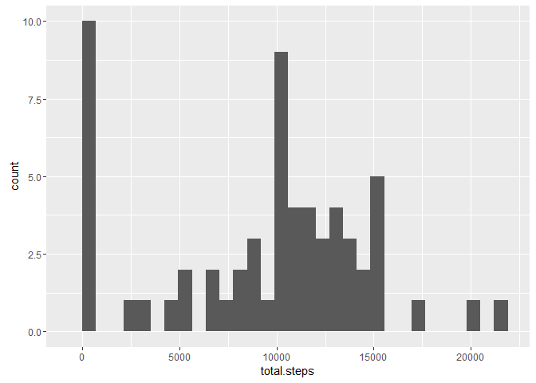
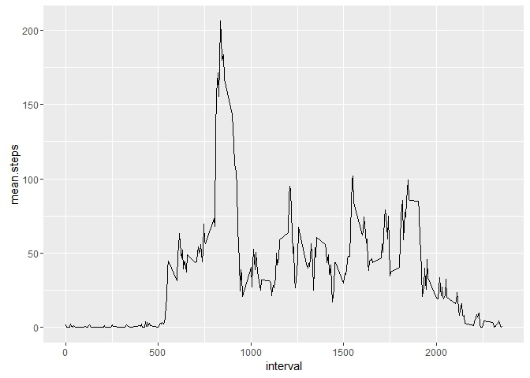
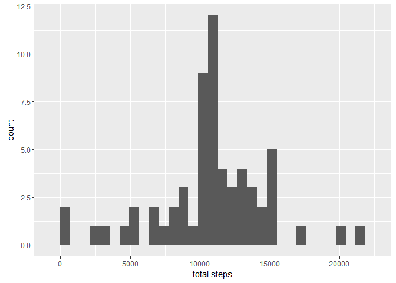
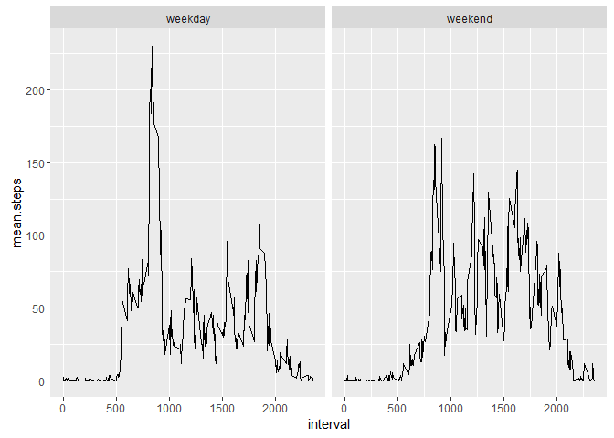

# Reproducible Research: Peer Assessment 1


```r
library(dplyr)
library(ggplot2)
```

## Loading and preprocessing the data

First we read the contents of our zip file, and aggregate by day and by interval.


```r
activity <- read.csv(unz("activity.zip", "activity.csv"))
activity$date <- as.Date(activity$date)

steps.by.date <- activity %>% group_by(date) %>% summarise(total.steps = sum(steps, na.rm = TRUE))
steps.by.interval <- activity %>% group_by(interval) %>% summarise(mean.steps = mean(steps, na.rm = TRUE))
```

## What is mean total number of steps taken per day?

The daily total step count follows this distribution:


```r
ggplot(steps.by.date, aes(total.steps)) + geom_histogram()
```



Mean daily step count is


```r
mean(steps.by.date$total.steps)
```

```
## [1] 9354.23
```

Median daily step count is


```r
median(steps.by.date$total.steps)
```

```
## [1] 10395
```


## What is the average daily activity pattern?

Activity varies throughout the day.  Witness the mean number of daily steps by interval:


```r
ggplot(steps.by.interval, aes(x = interval, y = mean.steps, group= 1)) + geom_line()
```



An early morning interval seems to have the largest number of total steps.  That interval is:


```r
activity[which.max(steps.by.interval$mean.steps), 'interval']
```

```
## [1] 835
```

## Imputing missing values

A large number of values in the dataset are missing ("NA").


```r
sum(is.na(activity$steps))
```

```
## [1] 2304
```

One strategy to fill in the missing values is to use the mean for the interval:


```r
imputed <- activity %>% inner_join(steps.by.interval, by = "interval")
missing.steps <- is.na(imputed$steps)
imputed$steps[missing.steps] <- imputed$mean.steps[missing.steps]
```

With our missing values filled in the new daily step count histogram looks like so:


```r
imputed.steps.by.date <- imputed %>% group_by(date) %>% summarise(total.steps = sum(steps, na.rm = TRUE))
ggplot(imputed.steps.by.date, aes(total.steps)) + geom_histogram()
```



The revised mean and media, with missing values imputed, are:


```r
mean(imputed.steps.by.date$total.steps)
```

```
## [1] 10766.19
```

```r
median(imputed.steps.by.date$total.steps)
```

```
## [1] 10766.19
```

Both mean and media have increased.  The increase in mean was more substantial.

## Are there differences in activity patterns between weekdays and weekends?


```r
imputed$weekpart = ifelse(weekdays(imputed$date) %in% c("Saturday", "Sunday"),
                          "weekend",
                          "weekday")
imputed$weekpart <- as.factor(imputed$weekpart)

imputed.steps.by.weekpart.interval <- imputed %>% group_by(weekpart, interval) %>% summarise(mean.steps = mean(steps))

ggplot(imputed.steps.by.weekpart.interval, aes(x = interval, y = mean.steps)) +
  facet_grid(. ~ weekpart) +
  geom_line()
```


